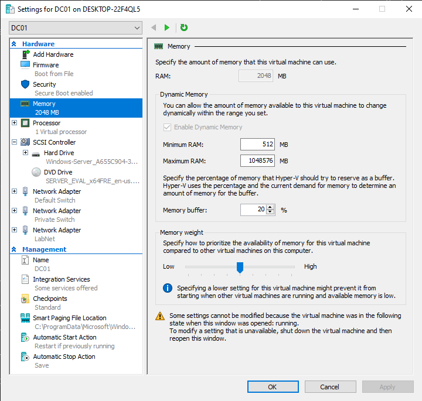
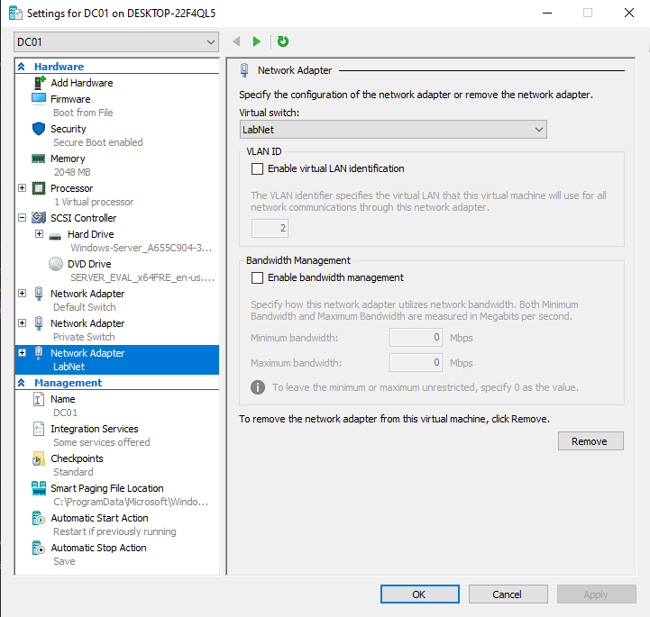
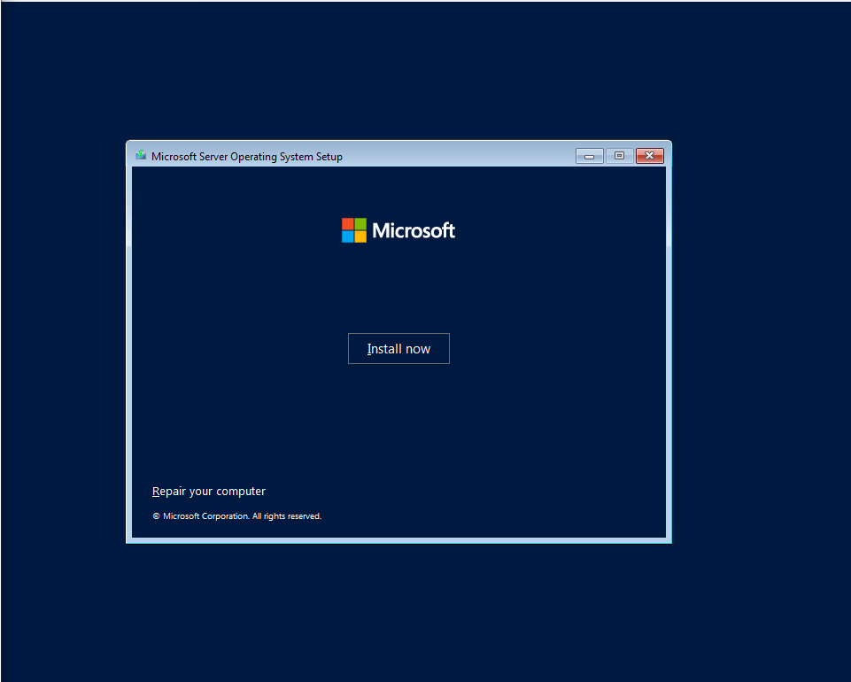
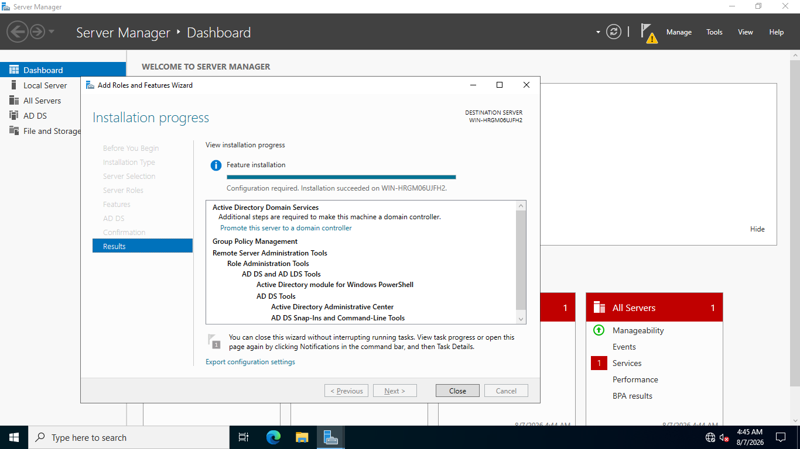
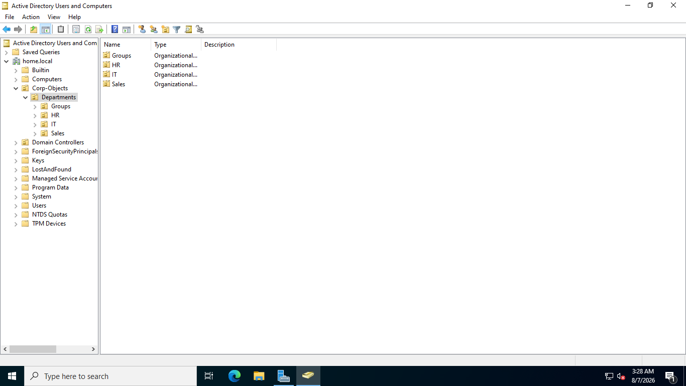
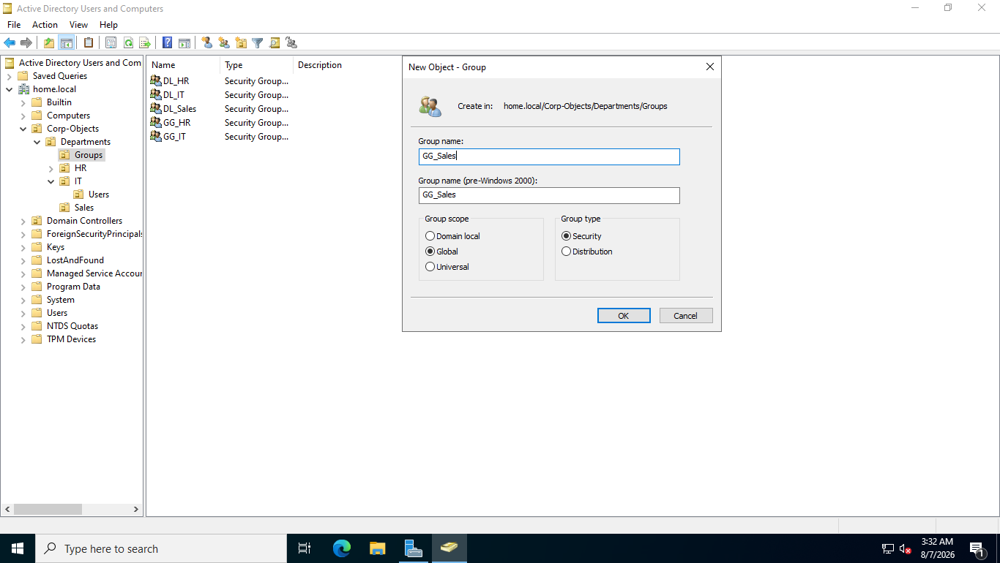
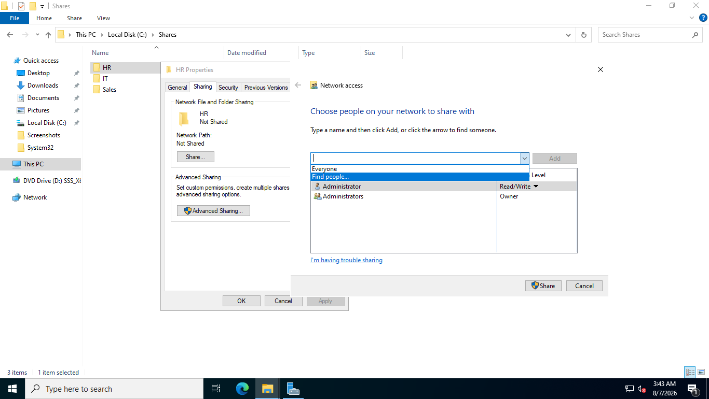
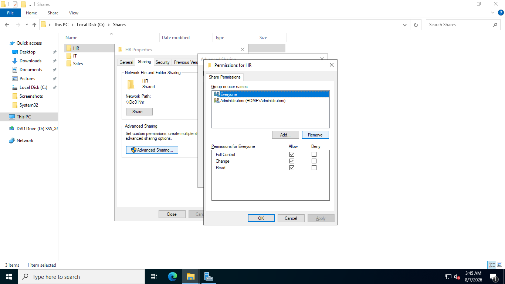
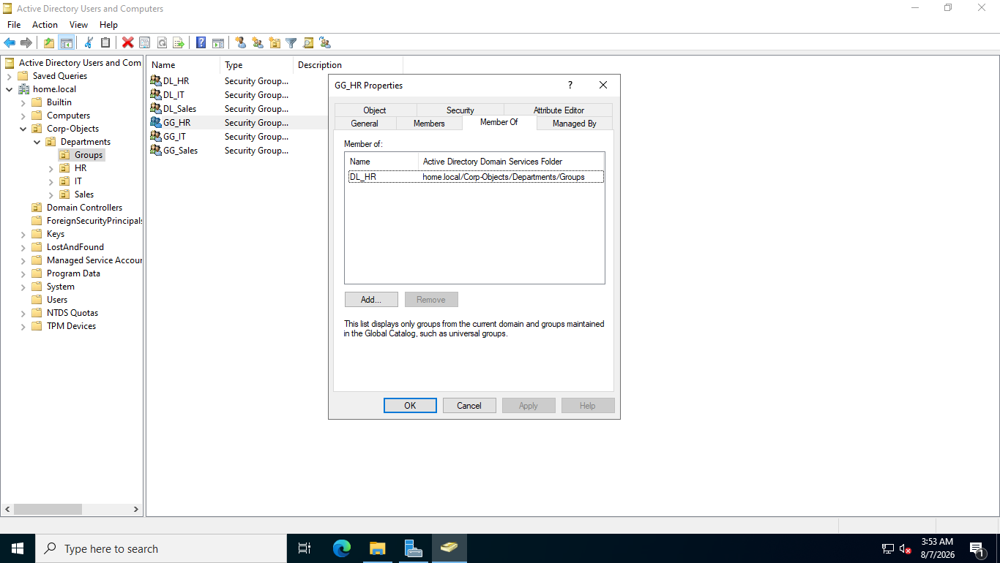

# 🏢 Active Directory Domain Services (AD DS) & Infrastructure Lab

## 📌 Executive Summary
This repository contains a step-by-step visual documentation of building an **Active Directory Infrastructure & Enterprise File Server** environment on **Windows Server 2022** using Hyper-V virtualization.

It covers virtual machine hardware provisioning, AD DS forest promotion, Organizational Unit (OU) design, RBAC group delegation (AGDLP), NTFS/Share permission hardening, and DNS Reverse Lookup Zone setup.

---

## 🛠️ Lab Architecture & Step-by-Step Walkthrough

### 01. Virtual Machine Hardware Provisioning (`screenshots/01-vm-setup`)
Configured a Generation 2 Hyper-V Virtual Machine for `DC01` with optimized resource allocation:
* **Firmware & Memory:** UEFI boot enabled, 4096 MB RAM.
* **Processor & Controller:** Multi-core virtual processor assignment with SCSI controller attached to vHDDs.
* **Network Isolation:** Dual network adapters configured (Default Switch + Dedicated Internal Isolated Switch).

---

### 02. Windows Server 2022 Installation (`screenshots/02-server-installation`)
Installed Windows Server 2022 Datacenter Edition with **Desktop Experience (GUI)** for administrative management.

---

### 03. Network Configuration & Server Identity (`screenshots/03-dc-networking`)
* **Computer Name:** Renamed host to `DC01`.
* **Static IP Assignment:** Configured static IPv4 address (`10.10.10.10/24`), Gateway, and loopback/primary DNS pointers.

---

### 04. AD DS Installation & Forest Promotion (`screenshots/04-active-directory-install`)
* Installed **Active Directory Domain Services (AD DS)** role.
* Promoted `DC01` as the Primary Domain Controller of a new forest (`home.local`).

---

### 05. Directory Hierarchy & User Management (`screenshots/05-ad-management`)
Created a structured Organizational Unit (OU) tree:
* **OU Structure:** `Corps-Object` $\rightarrow$ `Departments` $\rightarrow$ `IT`, `HR`, `Sales`.
* **Account Creation:** Provisioned domain users across departments with strict initial password requirements.
* **Group Management:** Created **Global Groups** (e.g., `GG_HR`) and **Domain Local Groups** (e.g., `DL_HR`) following the **AGDLP** model.

---

### 06. File Server & Share Permissions Hardening (`screenshots/06-file-server-permission`)
Configured enterprise file shares for departmental access control:
* **AGDLP Implementation:** Users placed in Global Groups (`GG_HR`), Global Groups assigned to Domain Local Groups (`DL_HR`), and `DL_HR` assigned explicit NTFS permissions.
* **Security Hardening:** Removed the default `Everyone` group from Share and NTFS Access Control Lists (ACLs). Granted explicit Read/Write and Full Control rights only to designated Domain Local groups.

---

### 07. DNS Manager & Active Directory Sites (`screenshots/07-dns-configuration`)
* **Forwarders:** Configured external DNS forwarders for internet resolution.
* **Reverse Lookup Zones:** Created `10.10.10.x` reverse lookup zone for IP-to-Hostname PTR record resolution.
* **AD Sites & Services:** Configured internal subnets and site topology bindings to optimize domain controller replication and client logon traffic.

---

### 08. Client VM Networking (`screenshots/08-client-vm-networking`)
*(Coming Soon - Provisioning Windows 10/11 Client Workstations on Internal Network)*

---

### 09. Domain Join & Authentication (`screenshots/09-domain-join-authentication`)
*(Coming Soon - Joining Workstations to `home.local` and testing departmental file share access)*
