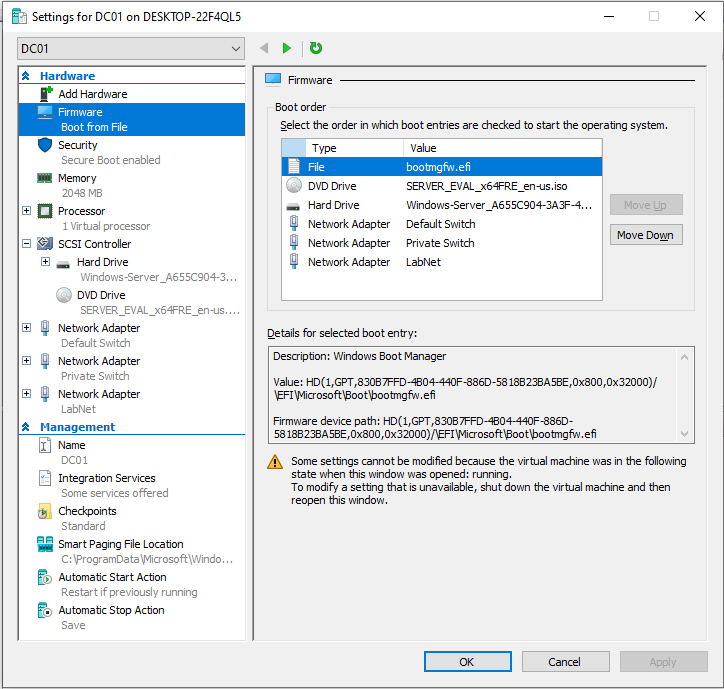
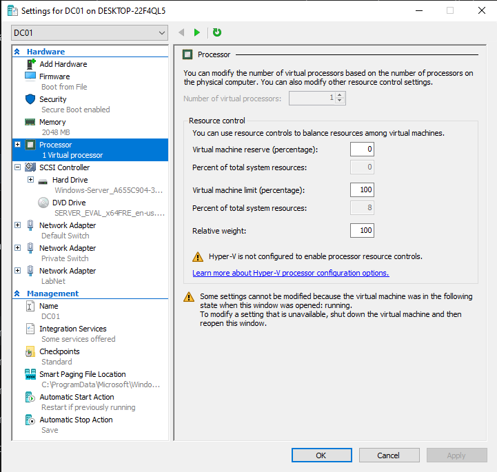
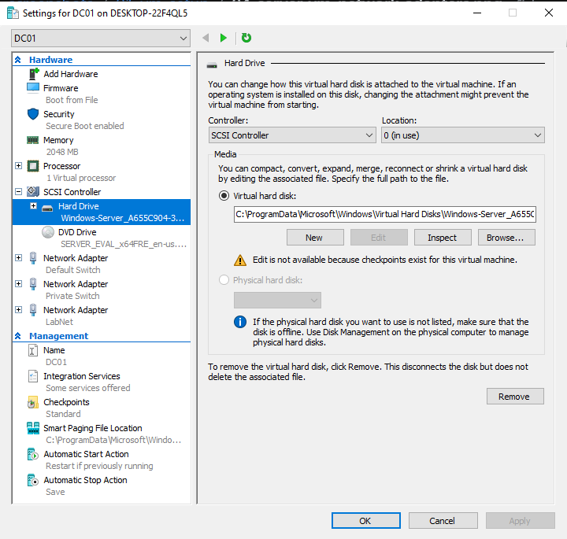
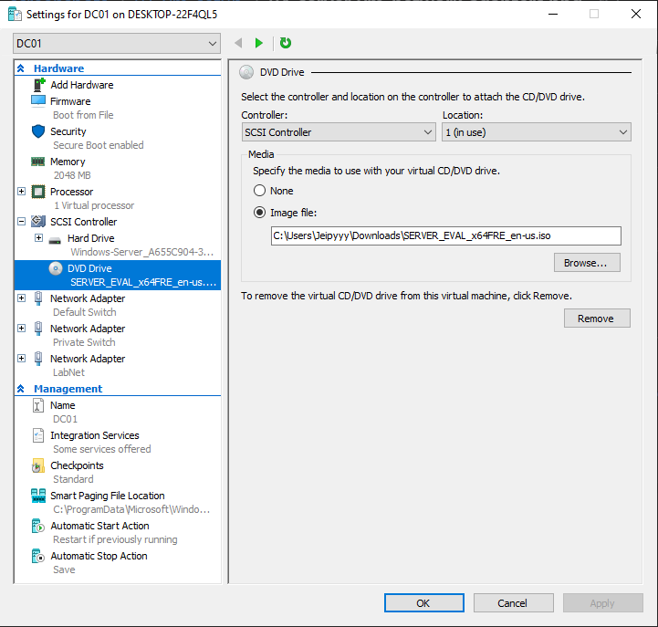
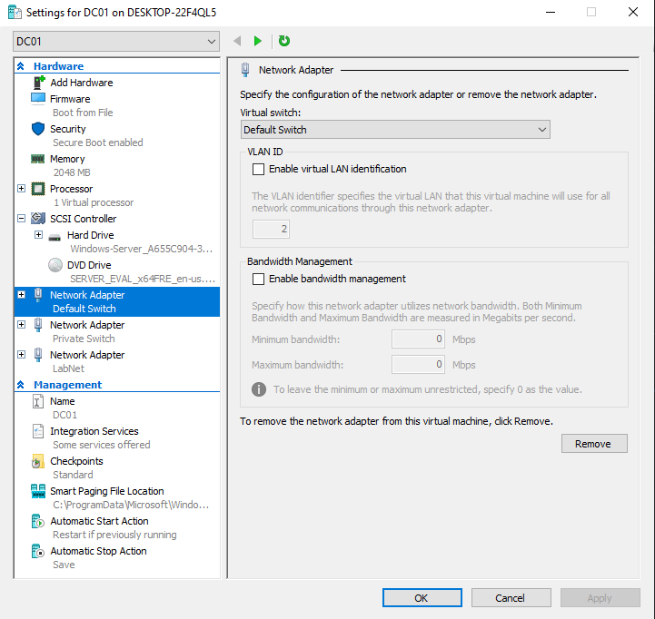

# 01. Virtual Machine Hardware Provisioning (Hyper-V)

## Overview
This document details the Generation 2 Virtual Machine setup for Domain Controller `DC01` on Windows Hyper-V.

## Configuration Specifications
* **Generation:** Generation 2 (UEFI Boot Enabled)
* **Memory:** 4096 MB RAM (Dynamic Memory Disabled for DC stability)
* **Processor:** 2 Virtual Processors assigned
* **Storage Controller:** SCSI Controller attached to `.vhdx` virtual disk
* **Network Adapters:**
  1. Default Switch (Management/WAN Access)
  2. Internal Switch (Dedicated Isolated Private Lab Network)

## Step-by-Step Screenshots

### 1. Firmware & Boot Order

### 2. Memory Allocation

### 3. Processor Cores

### 4. SCSI Storage Controller

### 5. Network Adapters Setup

