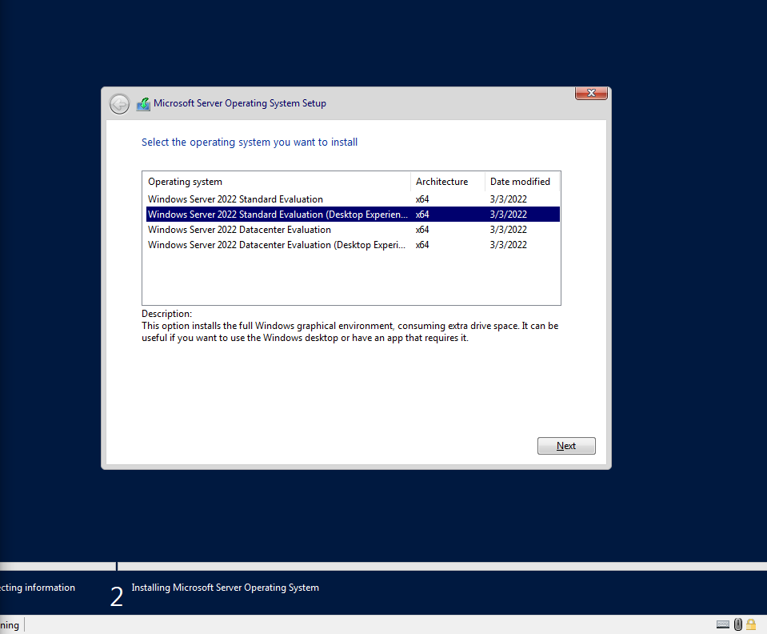

# 02. Windows Server 2022 Installation

## Overview
This guide details installing Windows Server 2022 Datacenter Edition with Desktop Experience on `DC01`.

## Key Installation Parameters
* **Operating System:** Windows Server 2022 Datacenter (Desktop Experience)
* **Installation Media:** Windows Server 2022 ISO attached to Hyper-V Virtual DVD Drive
* **Disk Partitioning:** Unallocated Space formatted with NTFS for primary System Volume (`C:\`)

## Step-by-Step Screenshots

### 1. Windows Server Setup Initialization

### 2. Operating System Selection (Desktop Experience)

