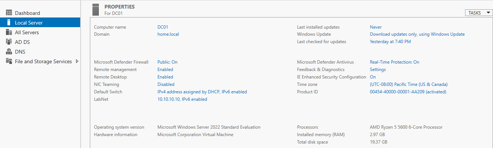
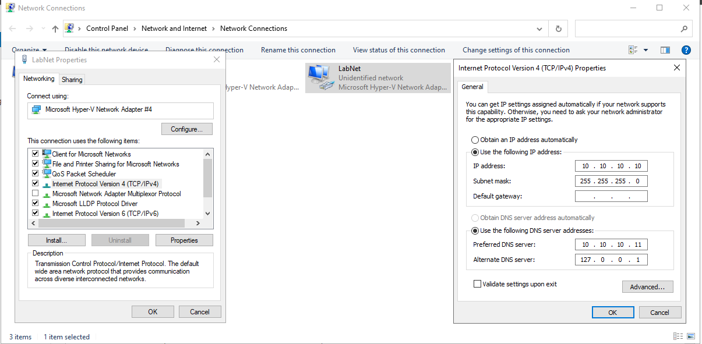
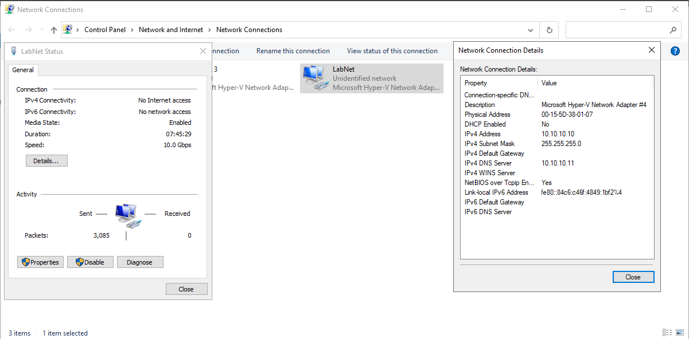

# 03. DC Networking & Computer Identity Configuration

## Overview
Before installing Active Directory Domain Services (AD DS), the server identity and TCP/IP networking configuration must be statically assigned.

## Network & Host Identity Parameters
* **Computer Name:** `DC01`
* **IP Address:** `10.10.10.10`
* **Subnet Mask:** `255.255.255.0` (`/24`)
* **Default Gateway:** `10.10.10.1`
* **Preferred DNS:** `127.0.0.1` (Loopback for Domain Controller DNS service)
* **Alternate DNS:** `10.10.10.1` (Gateway / External DNS)

## Step-by-Step Screenshots

### 1. Computer Name Configuration

### 2. Static IPv4 & DNS Assignment

### 3. Ethernet Interface Details Verification

