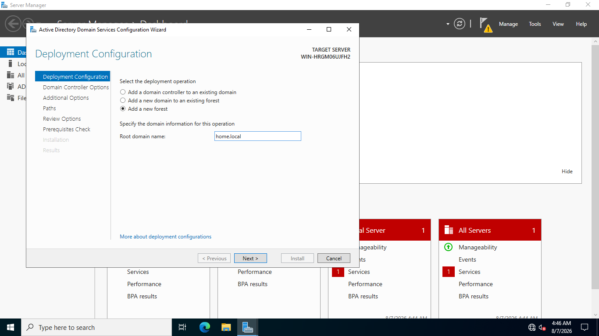

# 04. Active Directory DS Role Installation & Forest Promotion

## Overview
This document covers installing the Active Directory Domain Services (AD DS) server role and promoting `DC01` to a Primary Domain Controller for a new Active Directory forest.

## Forest Specifications
* **New Forest Root Domain Name:** `home.local`
* **Forest Functional Level:** Windows Server 2016 / 2022
* **Domain Functional Level:** Windows Server 2016 / 2022
* **DNS Server Role:** Installed alongside AD DS
* **Global Catalog (GC):** Enabled on `DC01`
* **Directory Services Restore Mode (DSRM) Password:** Configured during promotion

## Step-by-Step Screenshots

### 1. AD DS Role Installation Wizard

### 2. New Forest Creation (`home.local`)

