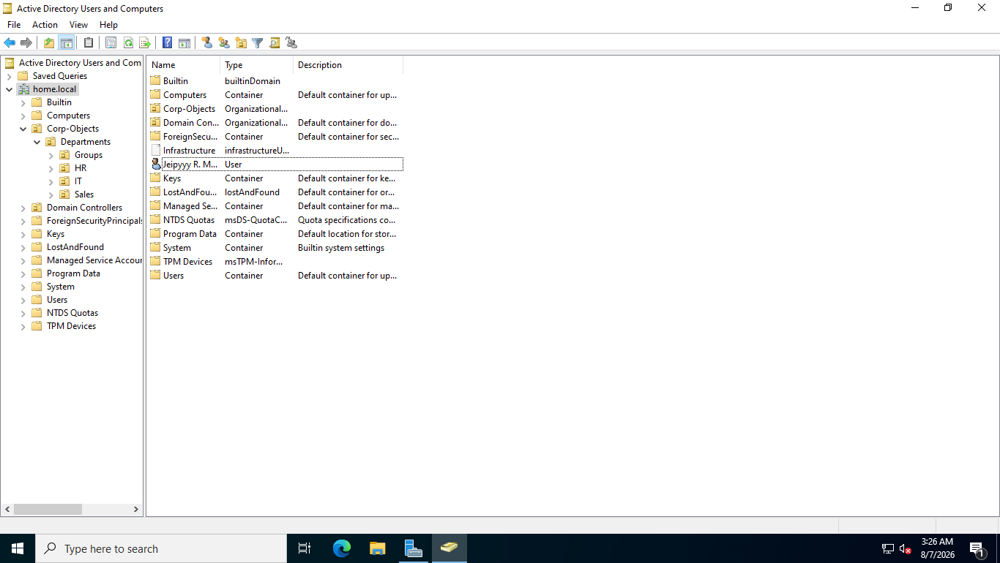
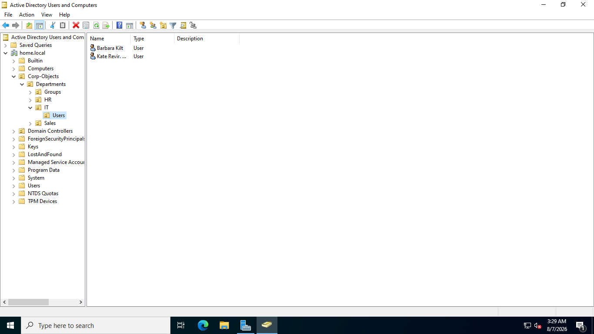
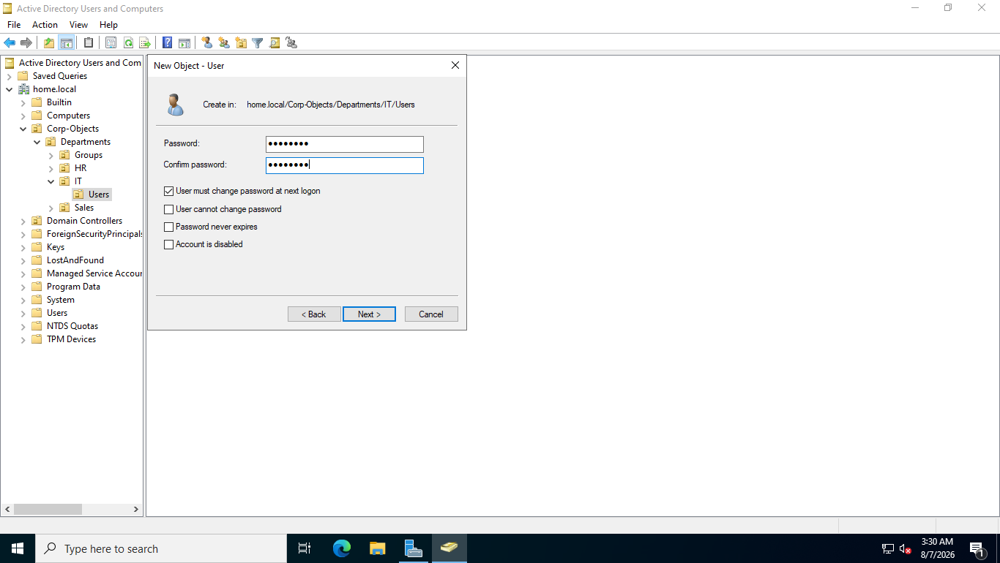
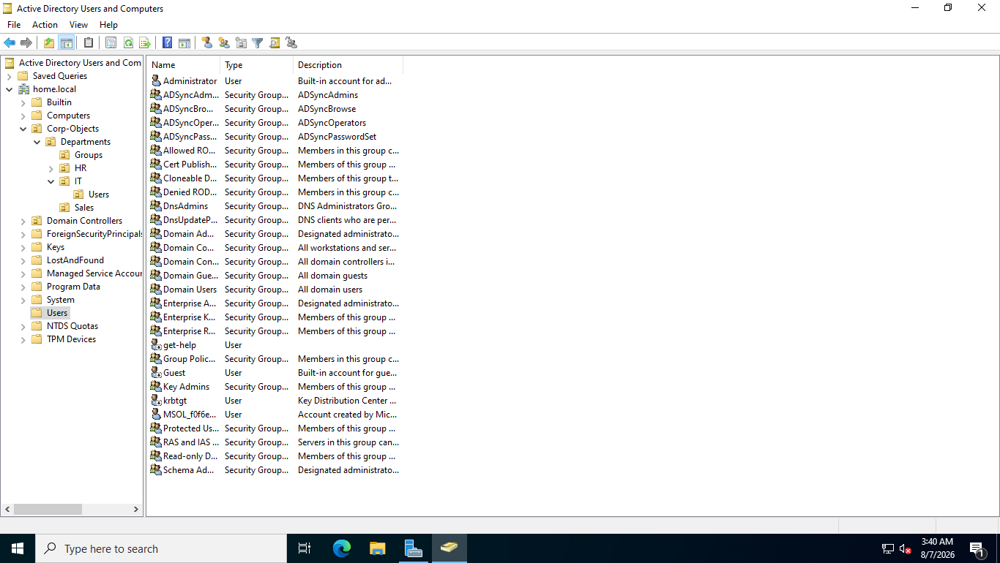

# 05. Active Directory Hierarchy & User/Group Management

## Overview
This document outlines the creation of the Organizational Unit (OU) structure and administrative user/group provisioning following the **AGDLP** (Account → Global Group → Domain Local Group → Permission) model.

## Directory Structure
```text
home.local
└── Corps-Object
    └── Departments
        ├── IT
        ├── HR
        └── Sales
```

## AGDLP Strategy
* **Accounts (A):** Individual user accounts (e.g. `jdoe`, `asmith`).
* **Global Groups (G):** Aggregates users by department/role (e.g., `GG_HR`).
* **Domain Local Groups (DL):** Assigned explicit resource access rights on servers/shares (e.g., `DL_HR`).

## Step-by-Step Screenshots

### 1. Organizational Unit Creation


### 2. User Account Creation & Password Configuration





### 3. AGDLP Security Group Creation



