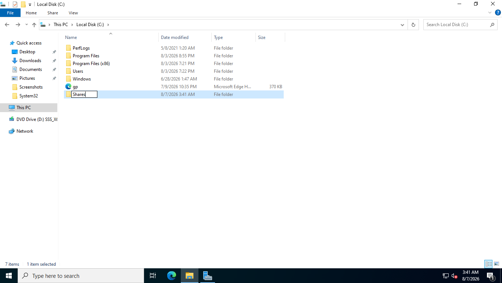
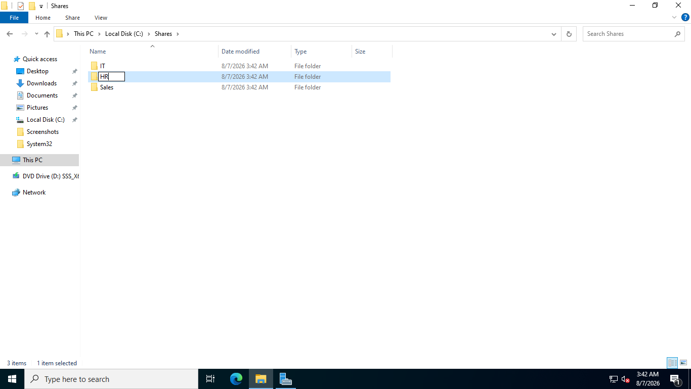
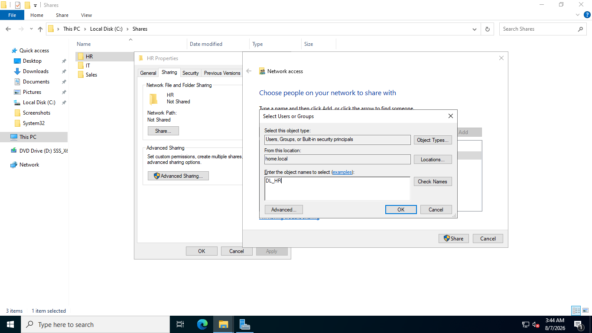
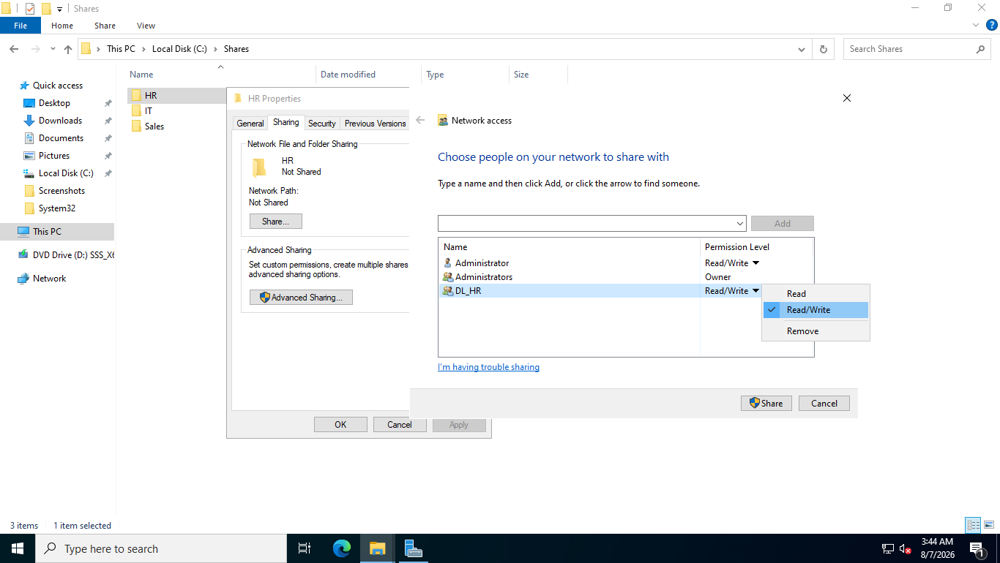
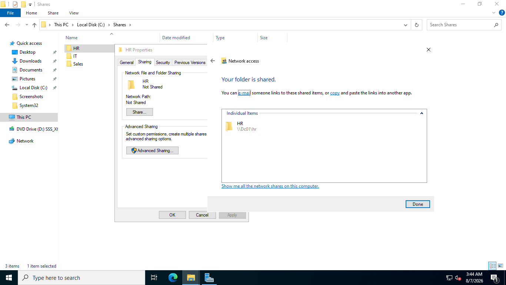
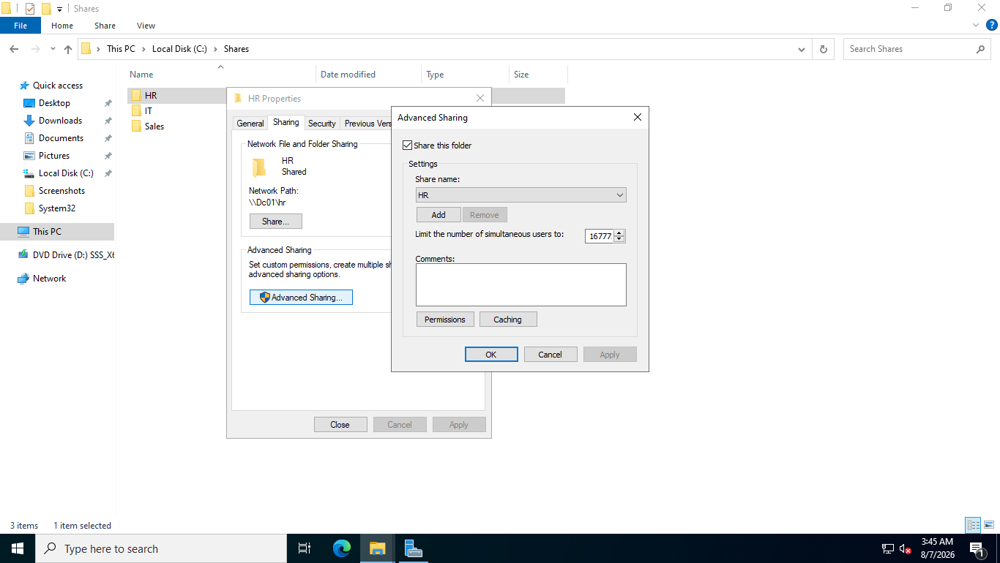
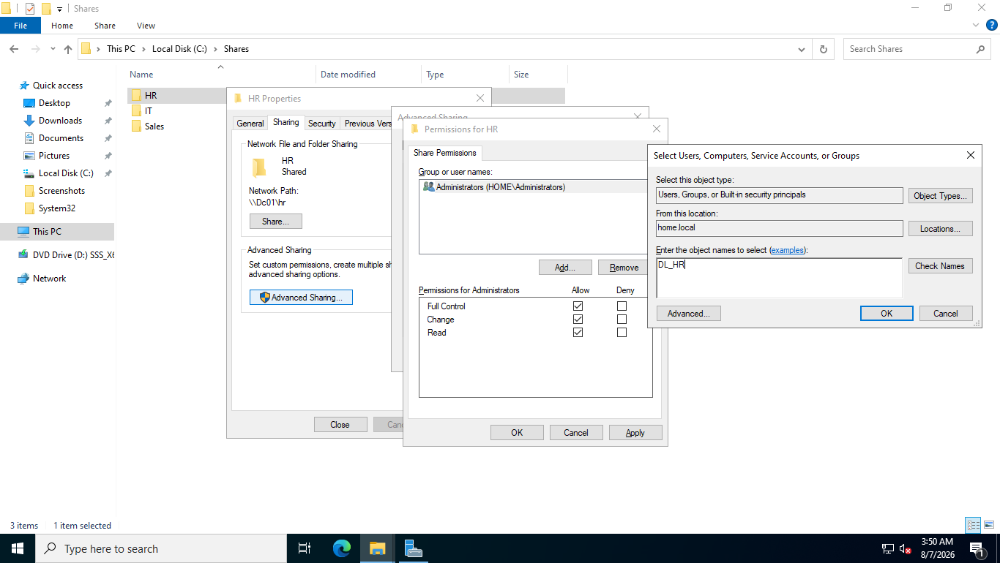
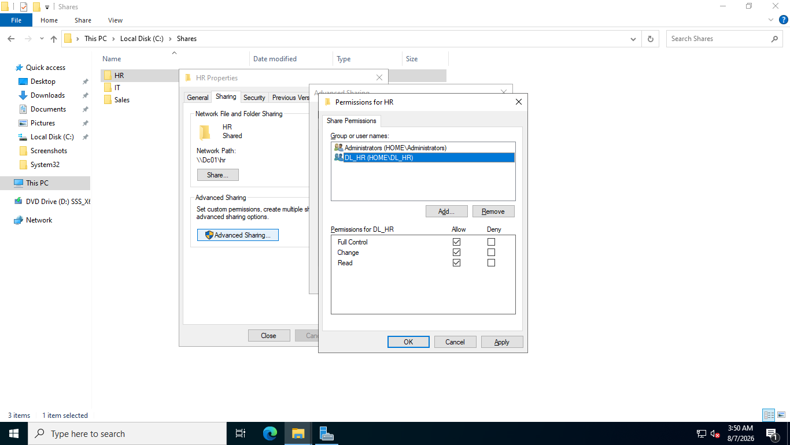
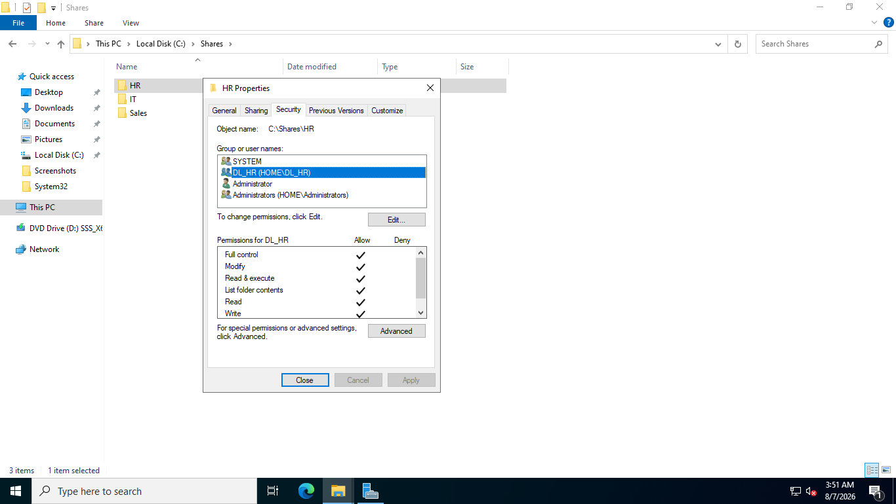
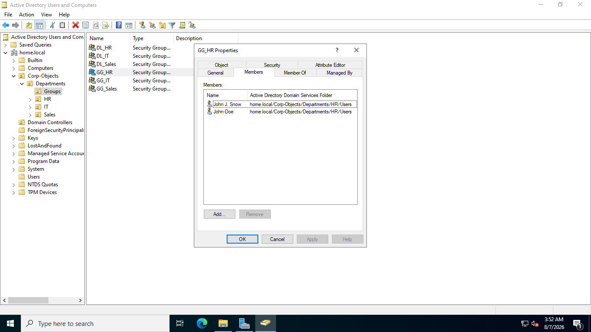

# 06. Enterprise File Server & Permission Hardening

## Overview
This guide covers setting up shared folders, hardening access rights, and enforcing the AGDLP access control framework on Windows Server 2022.

## Key Hardening Steps
1. **Remove `Everyone` Group:** Default access permissions were purged from Share and NTFS Access Control Lists (ACLs).
2. **Assign `DL` Groups:** Shared permissions were granted exclusively to Domain Local resource groups (e.g., `DL_HR`).
3. **Explicit Permissions:** Granted Read/Write and Full Control to authorized security principals only.

## Step-by-Step Screenshots

### 1. Share Folder Creation & OU Structure Setup

### 2. Share Permissions & Group Assignment

### 3. Hardening Access Control (Removing Everyone & Assigning Full Control)

### 4. NTFS Security Verification & Membership Check

