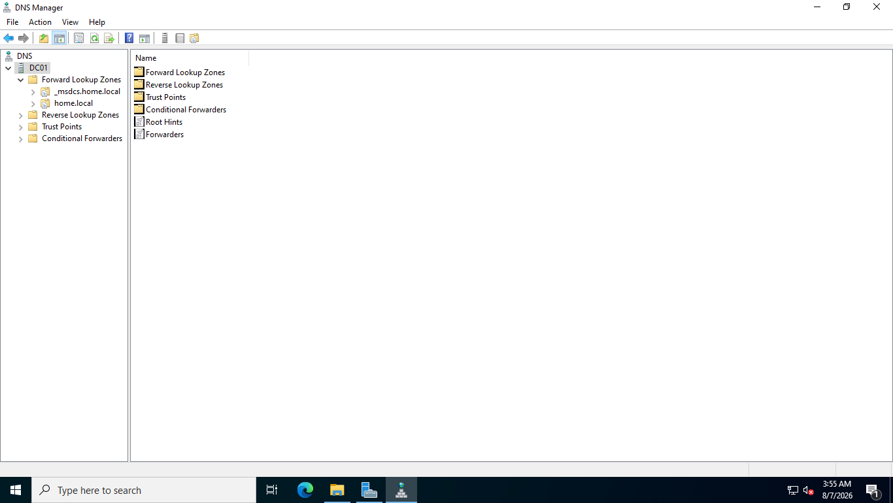
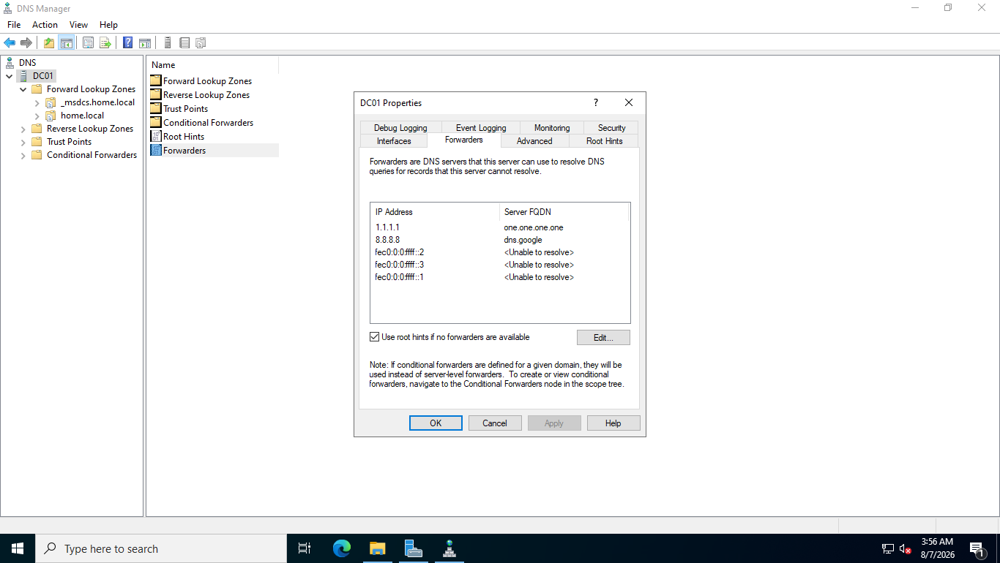
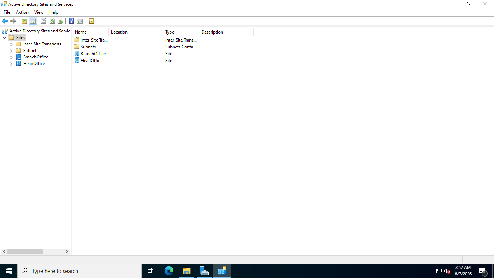
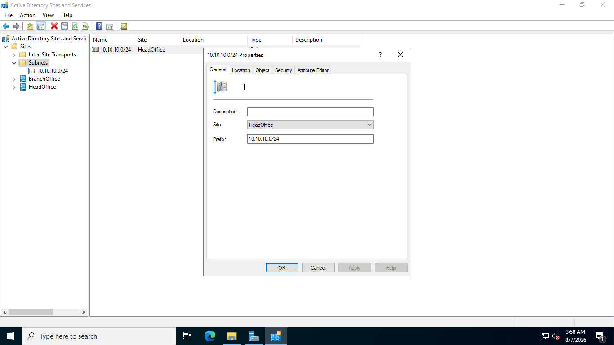

# 07. DNS Manager & Active Directory Sites & Services

## Overview
This document outlines DNS Server configuration, external forwarders, Reverse Lookup Zone creation, and Active Directory Sites and Services subnet binding.

## Core DNS & Site Components
* **DNS Manager:** Manages Forward Lookup Zones (`home.local`) and Reverse Lookup Zones.
* **DNS Forwarders:** External DNS servers (e.g. `8.8.8.8`, `1.1.1.1`) configured for public internet hostname resolution.
* **Reverse Lookup Zone:** `10.10.10.x` subnet PTR record mapping for IP-to-Hostname resolution.
* **AD Sites & Services:** Subnet object binding (`10.10.10.0/24`) assigned to Default-First-Site-Name to optimize AD replication and logon queries.

## Step-by-Step Screenshots

### 1. DNS Manager Interface

### 2. External DNS Forwarders Setup

### 3. Reverse Lookup Zone Configuration

### 4. Active Directory Sites and Services Management

